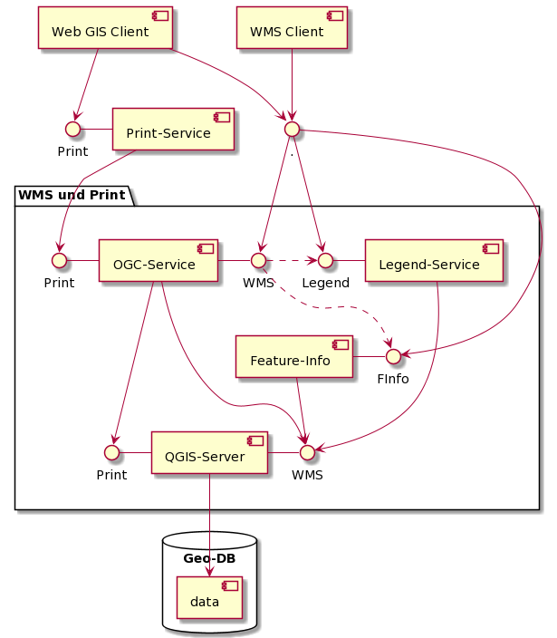
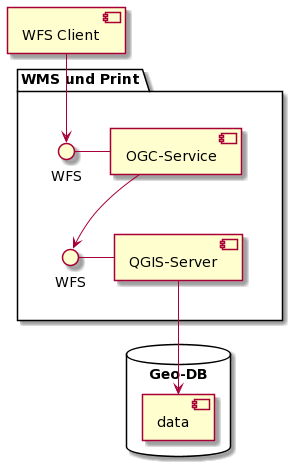

# API/WMS API/WFS und Print und Ext Layers

Der WMS ist ein komplexes konstrukt (zu) vieler Docker-Images, welche im Verbund die folgenden Funktionalitäten bereitstellen:

* "Offizieller" WMS und WFS Dienst des Kantons Solothurn
  * OGC-Service:
    * Verstecken der Kinder eines Facadelayer
    * Zugriffsschutz aufgrund übergebenem JWT-Token (ohne Token --> public)
  * Legend-Service:
    * Definieren von spezifischen Legenden für DatasetView oder Facadelayer
* Featureinfo-Service, welcher 
  * Anpassung des Ausgabe UI erlaubt (via Jinya-Template)
  * Anpassung der Quelle erlaubt (Default WMS-SO)
    * Quelle SQL: Abfrage auf eine Postgis-Datenbank
    * Quelle Py-Modul: Abfrage via Python-Plugin
  * Des Weiteren erledigt der Featurinfo-Service:
    * Formattierung der Werte der GetFeatureinfo-Response des QGIS Server (Datum, JA/Nein, ....)
    * Formattierung von Attributen mit Json-Response
    * Einblenden des Links von Objekt-Reports zu einem Feature

**Laufzeitabhängigkeiten WMS**



Die GetCapabilities-Antwort des OGC-Service verweist für die Abfrage von Feature-Infos und Legenden auf die dafür spezialisierten Komponenten (gestrichelte Linien).   
Das WMS-Interface des OGC-Service führt entsprechend "nur" GetCapabilities und GetMap-Requests aus

In Grafik nicht abgebildet:
* Raster-Geodaten 
* "Feature-Info" kann via SQL und Python-Modul weitere Datenquellen anbinden
* "Legend" kann extra erstellte Legendenbilder anbinden

**Laufzeitabhängigkeiten WFS**



# URL-Konfiguration (WMS, WFS und Print)

In der Konfiguration müssen die Einträge in Json-Template, Docker-Networking, Umgebungsvariablen, ... korrekt zusammenspielen.

Die Konfiguration wird von Innen (QGIS-Server) nach Aussen (OGC-Service) erläutert

## QGIS-Server

In den Json-Templates werden die Metadaten zu den Diensten definiert (inkl. Identifier für den WMS-Rootlayer)

Aus den Namen der generierten *.qgs und den Docker-Networking Settings folgt, auf welcher URL der QGIS-Server erreichbar ist. Das QGIS-Server Image publiziert die OGC-Dienste immer unter **/ows**

Beispiel:
* Die *.qgs heissen wms.qgs, wfs.qgs und qwc_print.qgs
* Konfig-Ausschnitt im docker-compose.yml:
  ``` yml
  ...
  qgs:
    ports:
      - "8081:80"
  ...
  ```

Damit wird der QGIS Server erreicht:
* Von Aussen
  * http://localhost:8081/ows/wms (.../wfs .../qwc_print)
* Von Innen (Anderer Service im docker-compose.yml)
  * http://qgs/ows/wms (.../wfs .../qwc_print)

## Feature-Info-Service

* Json-Template: 
  ``` json
  ...
  "config": {
    "default_qgis_server_url": "http://qgs/ows/"
  },
  "resources": {
    "wms_services": [
      {
        "name": "wms",
  ...
  ```
  Url und Service-Name werden zusammengesetzt zur QGIS-Server URL http://qgs/ows/wms
* docker-compose.yml:
  ``` yml
  ...
  feat_info:
    environment:
      - SERVICE_MOUNTPOINT=/wms_fi
    ports:
      - "5015:9090"
  ...
  ```
  Damit wird Feature-Info von Aussen erreicht auf http://localhost:5015/wms_fi/wms.   
  /wms folgt aus der Konfiguration "resources.wms_services.name" im Json-Template und wird implizit zur URL beigefügt.

## Legend-Info-Service

* Json-Template: 
  ``` json
  ...
  "config": {
    "default_qgis_server_url": "http://qgs/ows/"
  },
  "resources": {
    "wms_services": [
      {
        "name": "wms"
  ...
  ```
  Url und Service-Name werden zusammengesetzt zur QGIS-Server URL http://qgs/ows/wms
* docker-compose.yml:
  ``` yml
  ...
  legend:
    environment:
      - SERVICE_MOUNTPOINT=/wms_legend
    ports:
      - "5016:9090"
  ...
  ```
  Damit wird Feature-Info von Aussen erreicht auf http://localhost:5016/wms_legend/wms.   
  /wms folgt aus der Konfiguration "resources.wms_services.name" im Json-Template und wird implizit zur URL beigefügt.

## OGC-Service

Die Konfiguration des OGC-Service bezieht sich auf:
* Die URLs der "Backend-Services", welche der OGC-Service nutzt
* Auf welchen URLs die Funktionen des OGC-Service erreicht werden (Frontend-URLs)
* Auf welche URLs die WMS- und WFS-Clients via GetCapabilities verwiesen werden

### Konfiguration Backend-Services

Diese ist einzig vom Json-Template abhängig:

``` json
...
"config": {
  "default_qgis_server_url": "http://qgs/ows/"
},
"resources": {
  "wms_services": [
    {
      "name": "wms",
      "print_url": "http://qgs/ows/qwc_print"
      ...
    }
  ],
  "wfs_services": [{
    "name": "wfs"
    ...
  }]
}
...
```
**Resultierende Backend-URLs:**
* WMS: http://qgs/ows/wms
* WFS: http://qgs/ows/wfs
* Print: http://qgs/ows/qwc_print

### Frontend-URLs

Die Frontend-URL's folgen aus der Konfiguration im docker-compose.yml:

``` yml
...
ogc:
  environment:
    - SERVICE_MOUNTPOINT=/ogc
  ports:
    - "5013:9090"
...
```

**Resultierende Frontend-URLs:**
* WMS: http://localhost:5013/ogc/wms
* WFS: http://localhost:5013/ogc/wfs
* Print: http://localhost:5013/ogc/qwc_print

Der letzte Pfad (/wms, ...) folgt dabei aus der Konfiguration der Backend-URLs

### GetCapabilities

In der WMS GetCapabilities-Abfrage wird den Clients unter Anderem mitgeteilt, an welche URLs
die GetMap, GetFeatureInfo, GetLegendGraphics Abfragen zu richten sind. Die Konfiguration erfolgt über die "online_resources" Sektion im Json-Template:

``` json
...
"online_resources": {
  "service": "http://localhost:5013/ogc/wms",
  "feature_info": "http://localhost:5015/wms_fi/wms",
  "legend": "http://localhost:5016/wms_legend/wms"
}
...
```
